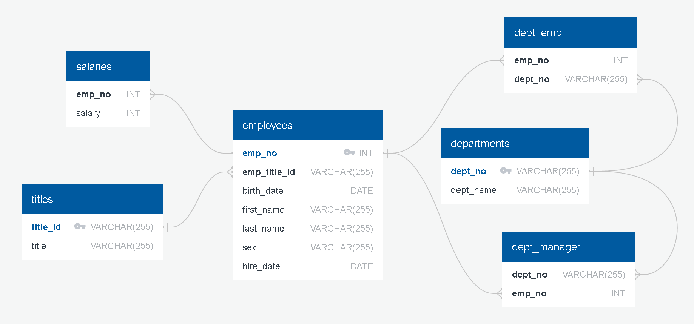
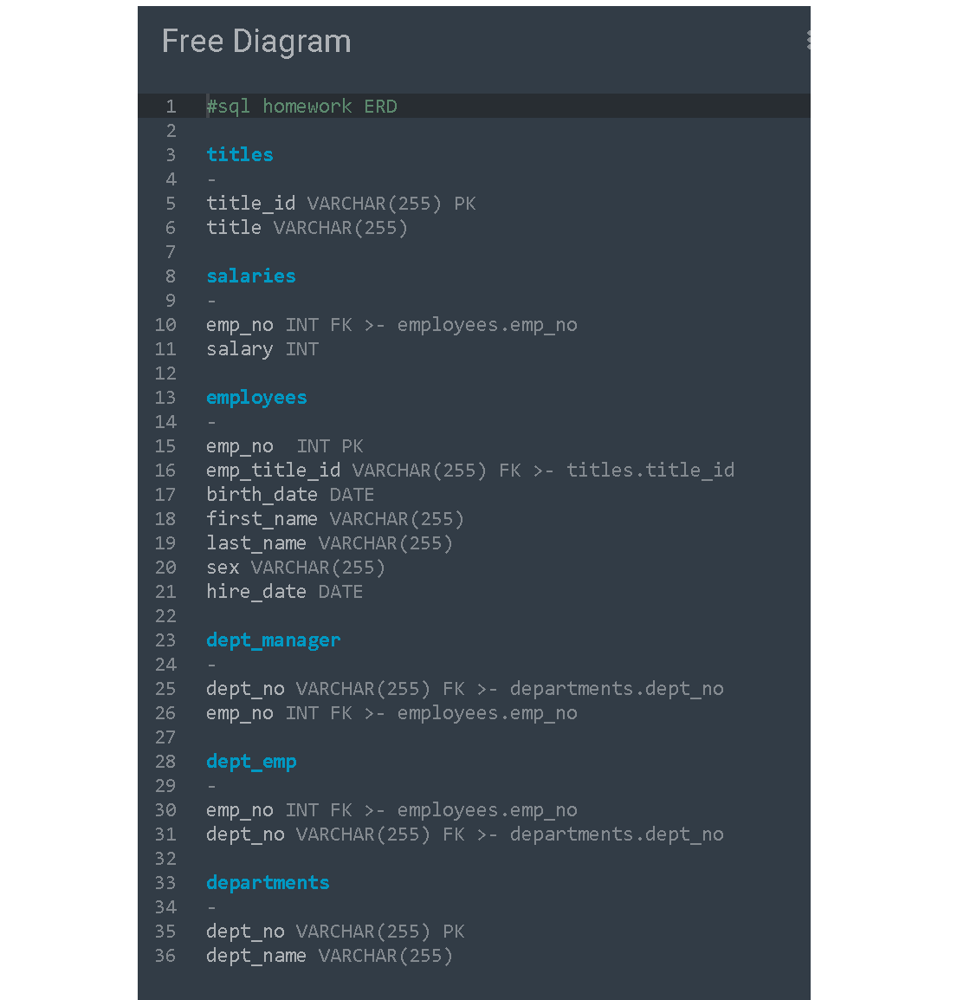

# SQL Homework - Employee Database: A Mystery in Two Parts

## Project Overview
This project consisted of creating a table schema of the provided 6 CSV files, importing these files into a SQL database, and answering questions about the data.

Languages and libraries used:

* SQL
* Pandas
* Numpy
* Matplotlib
* SciPy

---

### Data Modeling

After inspecting the CSVs, an ERD diagram was developed to show the relationships between the sets of data.

### Data Engineering

A table schema with each of the six CSV files, specifying data types, primary keys, foreign keys, and other constraints was created and data from each of the CSV files was imported (`schema.sql`).

### Data Analysis

With tables all configured, the data was analyzed. Testing and development of the queries done in a file titled, `query_testing.sql`, The final queries in the file, `queries.sql` display information for the following:

1. Listing the following details of each employee: employee number, last name, first name, sex, and salary.

2. Listing first name, last name, and hire date for employees who were hired in 1986.

3. Listing the manager of each department with the following information: department number, department name, the manager's employee number, last name, first name.

4. Listing the department of each employee with the following information: employee number, last name, first name, and department name.

5. Listing first name, last name, and sex for employees whose first name is "Hercules" and last names begin with "B."

6. List all employees in the Sales department, including their employee number, last name, first name, and department name.

7. Listing all employees in the Sales and Development departments, including their employee number, last name, first name, and department name.

8. Listing, in decending order, the frequency count of employee last names, i.e., how many employees share each last name.

## Bonus

SQL database was imported into Pandas for further analysis. The Jupyter Notebook file, `sql_bonus.ipynb`, contains the following:

1. The imported database (`SQL_homework_db`).

2. A histogram to visualize the most common salary ranges for employees.

3. A bar chart of average salary by title.

4. Details of employee with badge number 499942.

## Submission

* Image files of ERD in the Resources Folder.

* A `.sql` file of the table schema (`schema.sql`).

* A `.sql` file of the queries (`queries.sql`).

* A Jupyter Notebook of the bonus analysis (`sql_bonus.ipynb`).

